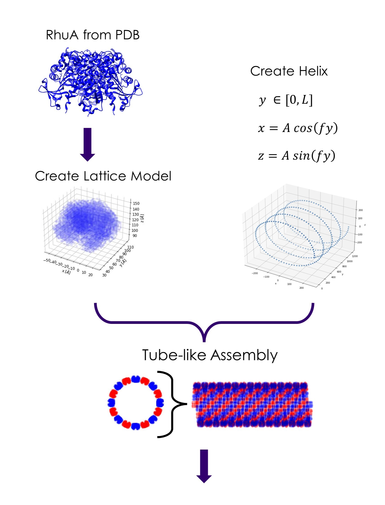
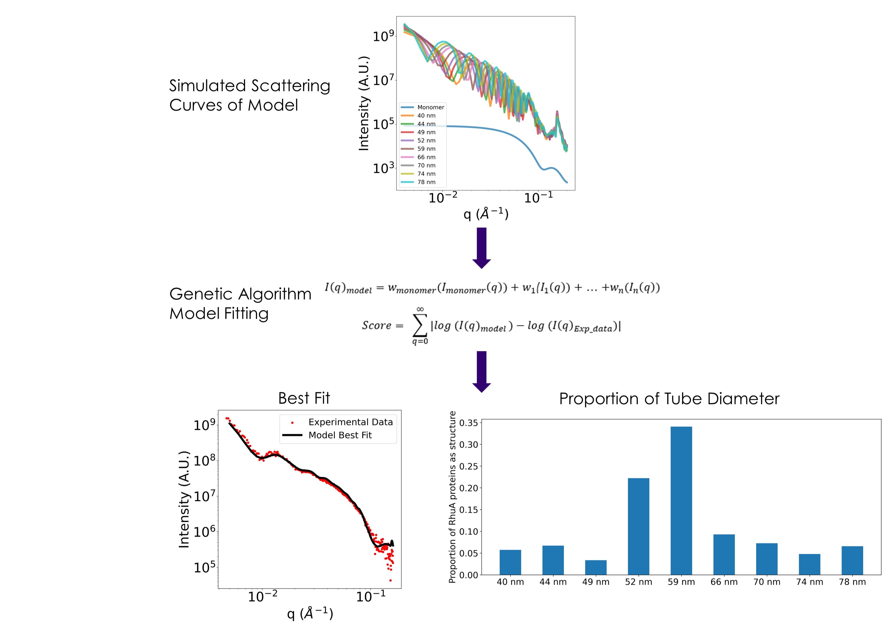

# RhuA_SAXS_Modeling

The repository contains code to fit experimental SAXS data of a polydisperse mixture of tube-like protein assemblies of different diameters. It is known that the RhuA protein assembles into tube-like structures based on microscpy images. The objective of this repository is to determine the distribution of tube diameter sizes in the sample from its experimental SAXS curve. The method to do this can be summaries in the following steps:

1. Obtain the 3d cartesian coordinates of a single RhuA protein from its PDB file.
2. Assemble the protein's coordinates in a helical structure to create a tube-like model. Repeat this step for different tube diameter sizes.  
3. Calculate the scattering curve of each tube model using the spherical harmonics method
4. Calculate the weighted average of all the scattering curves, where each weight is a parameter to be optimized. Also create a score function which is the log mean square error between the experimental scattering curve and the weighed average of the simulated ones. 
5. Use an optimization algorithm to find the best weights that minimize the log mean square error. 

   

   

